# Curebase Technical Assessment - Sr. Engineer

[](https://github.com/cdgn-coding/curebase-challenge/actions/workflows/pr_checks.yml)

## Table of Contents

- [Introduction](#introduction)
- [Scaffolding](#scaffolding)
- [Architectural Decisions](#architectural-decisions)
  - [Re-scaffolding with Turborepo](#re-scaffolding-with-turborepo)
  - [Frontend: Migrated to Next.js](#frontend-migrated-to-nextjs)
  - [Styled Components](#styled-components)
  - [Key Implementation Details](#key-implementation-details)
- [Running Instructions](#running-instructions)
  - [Using Docker](#using-docker)
  - [Development](#development)
- [Testing](#testing)
  - [Unit tests](#unit-tests)
  - [Integration tests](#integration-tests)
  - [Cross-Browser Testing](#cross-browser-testing)
- [Linting](#linting)
- [Core Web Vitals](#core-web-vitals)
- [Continuous Integration](#continuous-integration)
- [Deployment](#deployment)

## TL;DR

[Loom Video - < 3 minutes](https://www.loom.com/share/140239e1210e4e9aa8b01ac141973f89?sid=a2264ca9-5f8b-4f5c-9d7d-7e704aa2ab8e)

## Introduction

This is a technical assessment for the Sr. Engineer position at Curebase. The assessment is a full-stack application built with Next.js, NestJS, and GraphQL. The application is designed to allow users to enroll in trials and view a list of participants.

The frontend application is accessible at https://curebase.carlosnexans.com.

The GraphQL API is accessible at https://api-curebase.carlosnexans.com/graphql.

## Scaffolding

```
.
├── apps
│   ├── api                 # NestJS backend application
│   └── web                 # Next.js frontend application
└── packages
    ├── ui                  # Shared UI components
    └── eslint-config       # Common ESLint configuration
```

## Architectural Decisions

### Re-scaffolding with Turborepo

I re-scaffolded the application using Turborepo for the following benefits:

- Organized Monorepo: Turborepo allows a clean separation of frontend, backend, and shared packages, fostering better modularity and scalability.

- Efficient Builds: It supports incremental builds and caching, resulting in faster development iterations and optimized CI/CD pipelines.

- Ease of Dependency Management: With clearly defined workspaces, managing shared dependencies is straightforward, reducing potential conflicts.

### Frontend: Migrated to Next.js

I chose Next.js over Create React App (CRA) due to its extensibility, community support, and alignment with modern web development standards:

**Key Advantages:**

- Full-Stack Support: Next.js enables seamless server-side functionality within the same codebase, enhancing developer experience and productivity.

- Enhanced Security: Server-side Middleware can be used to handle CSRF protection, login flows, and session validation. In general, direct integration between frontend and backend ensures better control over sensitive operations.

- Performance Enhancements: Server Components improves percieved performance to the user. Streaming and Code Splitting allows for optimal performance and user experience.

- Adoption and Community: As noted in the State of JS survey, most of the React community has moved to metaframeworks. Next.js is the most widely adopted metaframework, ensuring better support, tooling, and resources.

### Backend: NestJS, GraphQL, and PostgreSQL

I retained NestJS for the backend and GraphQL for API communication, while choosing PostgreSQL as the database solution:

- NestJS provides a modular and scalable architecture, ideal for implementing complex business logic.

- GraphQL is well-suited for the application's needs, offering:
  - Flexible querying capabilities.
  - A strongly-typed schema, ensuring robust data validation and type safety.

- PostgreSQL was selected as the database for several key advantages:
  - ACID Compliance: Ensures data integrity and reliability
  - Scalability: Excellent performance with large datasets and concurrent users
  - Rich Feature Set: Advanced indexing, full-text search, and constraint capabilities
  - Strong Community: Extensive tooling and support ecosystem

This combination ensures a clean separation of business logic, better maintainability, and extensibility.

### Styled Components

I continued using Styled Components for styling the frontend, even though they do not currently support React Server Components. My rationale:

- Future-Proofing: Styled Components are likely to adopt server components support in the future, aligning with the React team's direction.

### Key Implementation Details

**Frontend:**

- Framework: Next.js for responsive and performant frontend development.

- Styling: Styled Components for modular and dynamic styling.

- Validation: Client-side form validations with Zod and React Hook Form. This ensures data integrity before API calls using safe declarative approach.

- Modular: Components are modular and reusable, ensuring a clean and maintainable codebase.

**Backend:**

- Framework: NestJS for building a scalable backend.

- GraphQL: Implemented resolvers for participants and trials.

- Validation: GraphQL schemas enforce type-safe API communication.

- Dockerization: Packaged the entire application in Docker for consistent and easy deployment.

## Running Instructions

### Using Docker

```bash
docker-compose up
```

Navigate to http://localhost:3000 to view the application.

Navigate to http://localhost:3001/graphql to view the GraphQL playground.

### Development

Install dependencies

```bash
npm install
```

Start postgres database

```
docker-compose up -d db
```

Run migrations and seed the database
```
npm run db:migrate
npm run db:seed
```

Run the development server

```bash
npm run dev
```

Navigate to http://localhost:3000 to view the application.

Navigate to http://localhost:3001/graphql to view the GraphQL playground.

## Testing

Test coverage is enforced through CI/CD pipelines:
- API: Minimum 85% coverage requirement
- Web: Minimum 80% coverage requirement

### Unit tests

```bash
npm run test:unit
```

### Integration tests

Start the database

```
docker-compose up -d db
```

If necessary, run migrations and seed the database

```
npm run db:migrate
npm run db:seed
```

Run integration tests

```bash
npm run test:integration
```

### Cross-Browser Testing

The application has been tested across multiple browsers to ensure consistent functionality and appearance. I used saucelabs to run the tests.

#### Microsoft Edge 132 (Windows 11) - Participants

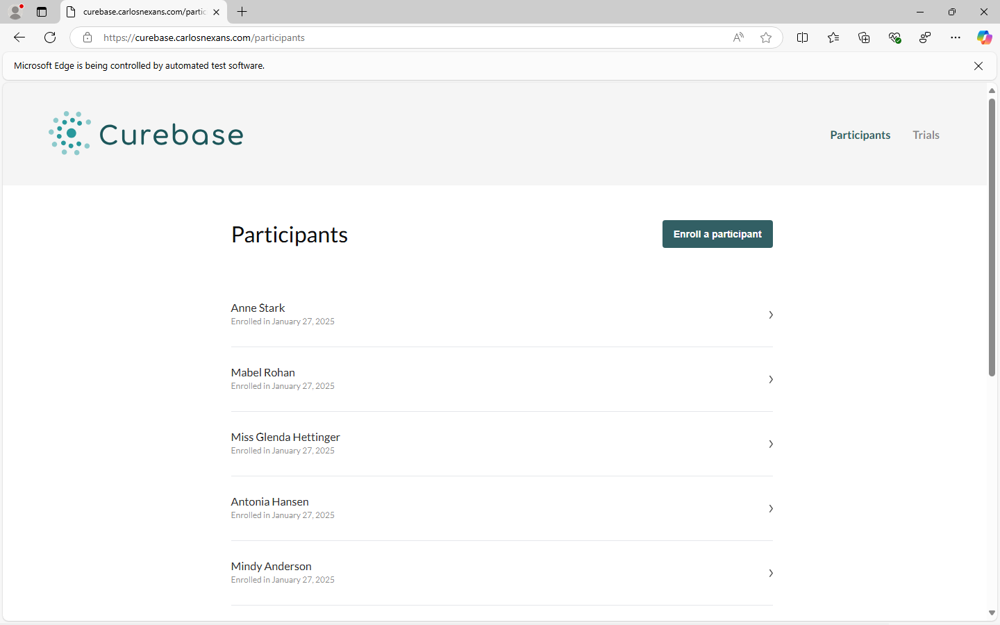

#### Mac 13 Safari 17 - Participants

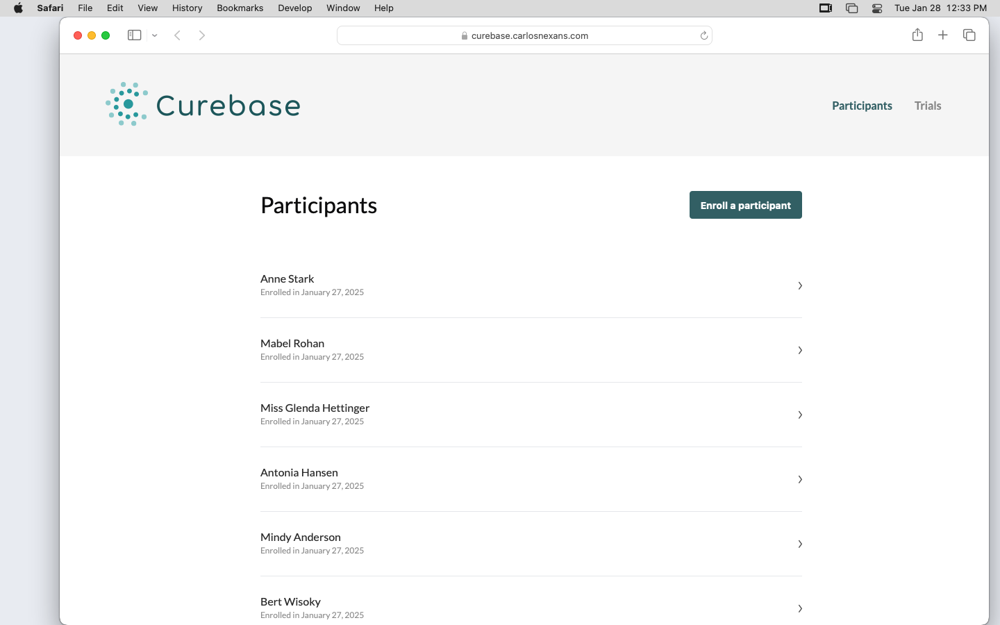

#### Windows 11 Firefox 134 - Participants

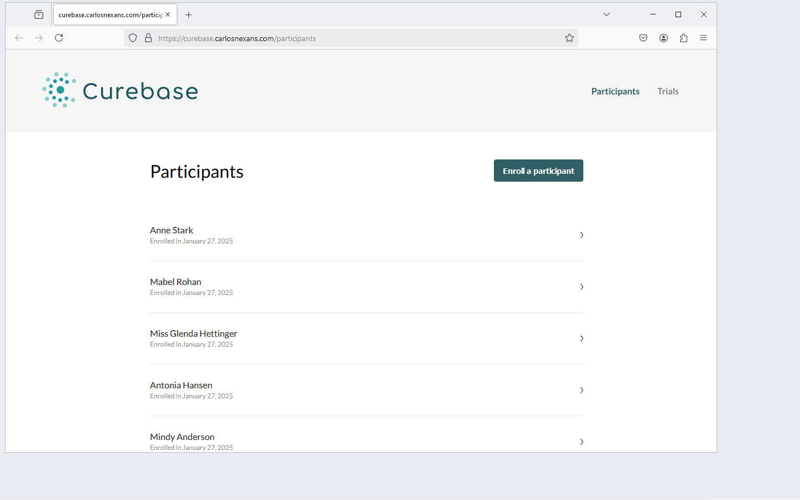

#### Mac 13 Safari 17 - Enroll a participant

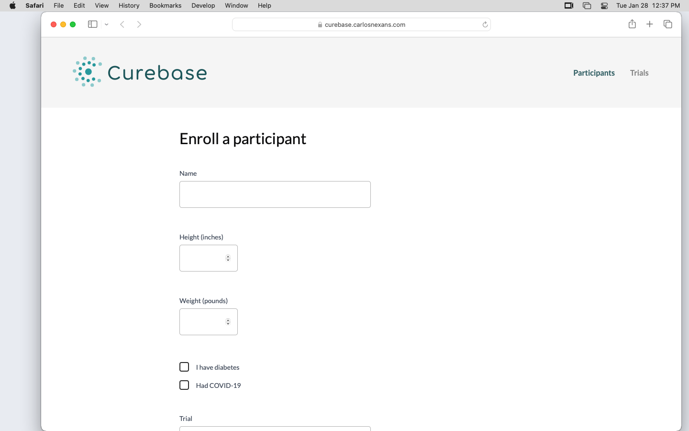

#### iPhone 12 - Participants

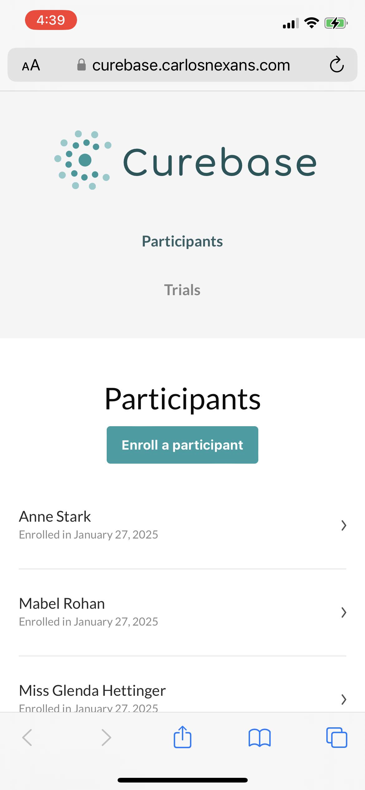

#### iPhone 12 - Enroll a participant

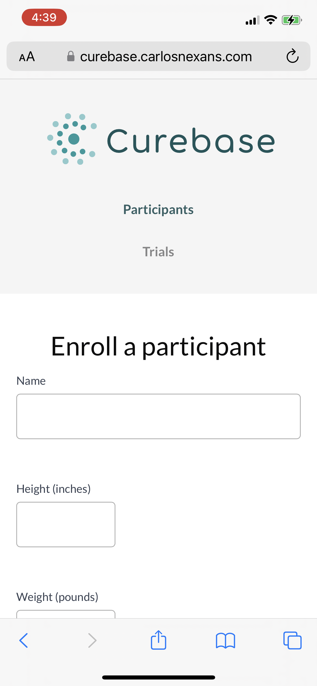

## Linting

```bash
npm run lint
```

## Core Web Vitals

I used PageSpeed Insights to measure the Core Web Vitals of the application. You can access the results at https://pagespeed.web.dev/analysis/https-curebase-carlosnexans-com-participants/nu1dxz3skw?form_factor=mobile.

### Mobile

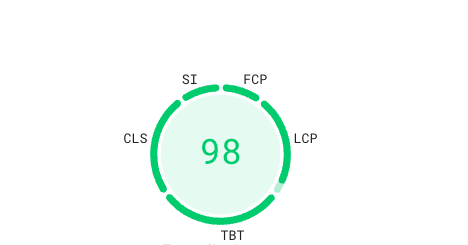

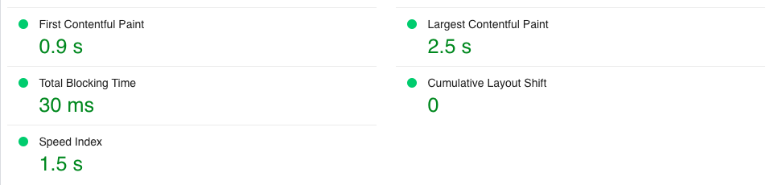

### Desktop

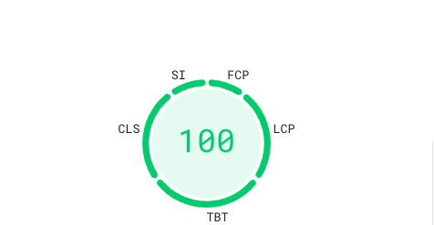

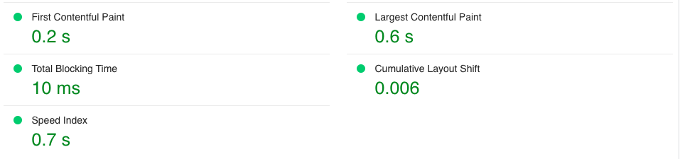

## Continuous Integration

The application is built and tested on every PR. The build and test results are available in the PR checks.

[](https://github.com/cdgn-coding/curebase-challenge/actions/workflows/pr_checks.yml)

In each PR, the following checks are performed:

- Build: Builds the application and checks for errors.
- API Tests and Web Tests: Runs unit and integration tests for both applications.
- Lint: Runs linting and checks for errors.

## Deployment

The application is deployed to Digital Ocean droplets using Docker.

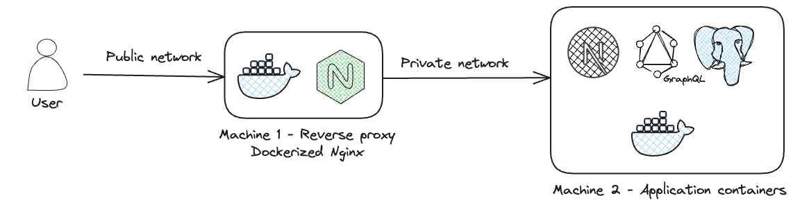
